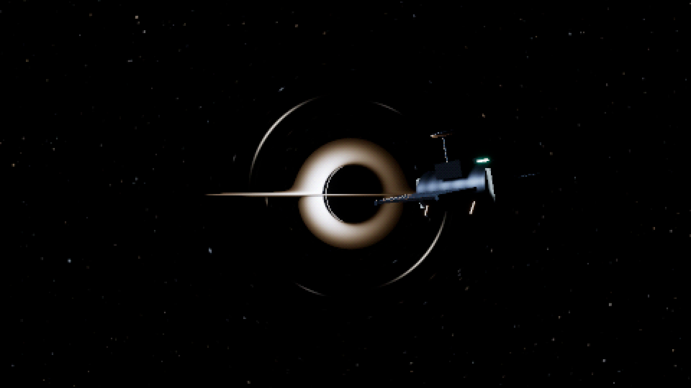
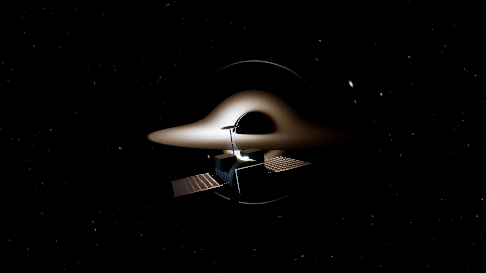
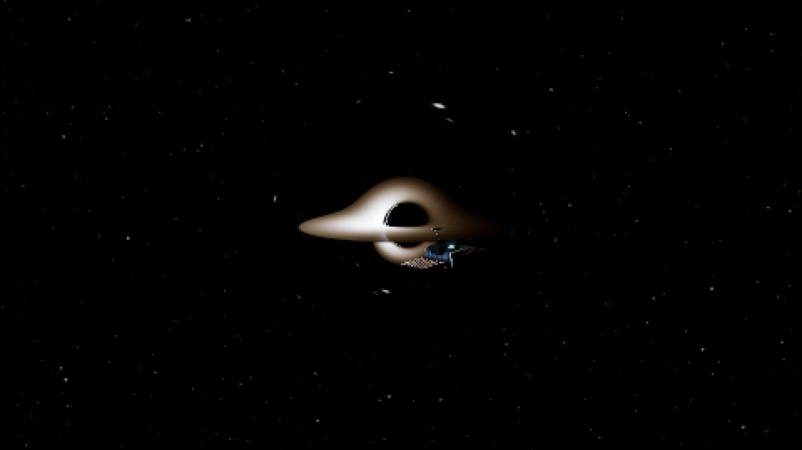
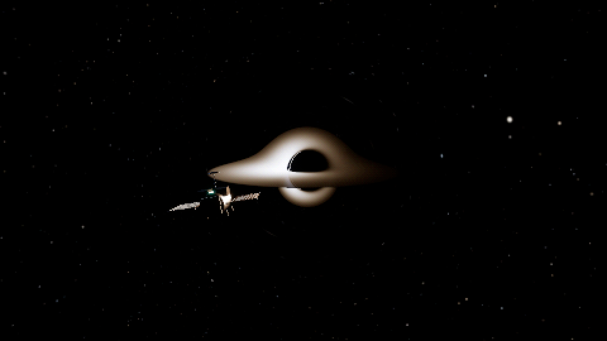

# Visual findings

The images below are unretouched native GPU captures. They show the actual interactive scene; no lensing images or camera-specific effects are used by the renderer. Development review covered distant, edge-on, above-disk, close, aligned-source, foreground-probe, near-limit and presentation-bypass views, plus successive moving frames and numerical overlays.

## What works

The nearly edge-on disk has a thin direct image and far-side images above/below the dark capture region. Asymmetric thermal radiance and a shifted spinning shadow remain visible through the grid. Sparse stars and a faint outer arc sit in predominantly black vacuum. The sky is not filled with coloured fog.

The probe retains cool metallic highlights, warm radiator frames, ceramic/insulating edges, dark coating and a small emissive instrument. F7 reveals the same lighting and geometry at a finer presentation scale. The grid is an image treatment, not faceted or voxel geometry.

Bright disk emission still compresses into a broad white band after exposure/ACES. This reduces fine radial colour structure. Some radiator ribs, antennas and star images approach a single presentation cell and change coverage with movement.

## Motion evidence

These are endpoints of an inspected 12-frame sequence captured every 0.15 seconds during live guided flight. The probe crosses the foreground while upper/lower disk images deform continuously and the dark center remains coherent. This supports dynamic scene continuity; it does not prove flicker-free output at display refresh rate or replace human flight acceptance.

TAA currently stabilizes foreground PBR only. The lensed sky uses directional spatial filtering and stable area reduction. Thin critical curves, stars and highlights remain the main temporal risks.

## Numerical quality is visible

F11 marks exhausted budgets. Cheap 128-step Kerr leaves a thin critical-rim strip in this view. Reduced output can hide individual unfinished physical texels, so diagnostics should also be inspected with spatial quantization disabled.

GPU error checks drove refinement of the high-quality safety caps and an increase to 768 steps. In the reviewed chi=0.8 close view, the final unquantized high diagnostic had five amber physical texels (residual 1e-4..1e-3), no red (>=1e-3) and no exhaustion. At chi=0.98, 24 physical texels remained exhausted near the narrow critical edge even at the maximum budget. This is a known limit, not resolved scientific capture data. M shows normalized null/axial constraint bands, not direct angular error or universal convergence.

## Remaining boundaries

- The probe is conventionally projected and is not gravitationally lensed/occluded. Flying behind the hole/disk exposes this architectural limit.
- Disk lights approximate illumination with point samples; they are not GR transport.
- Disk thickness, fluid/plasma evolution, polarization and retarded emission are not modeled.
- An exactly coplanar zero-thickness disk intersection is singular; use a slight observer elevation.
- The observer is externally supported and static at each position, without velocity aberration. The supported cutoff does not depict the interior.

The result is a useful laboratory for evaluating quantized HDR/PBR in motion. Numerical reference work, lens-aware temporal history and human fly-through validation are needed before treating it as a production renderer. See [math](MATH.md) and [performance](PERFORMANCE.md).
